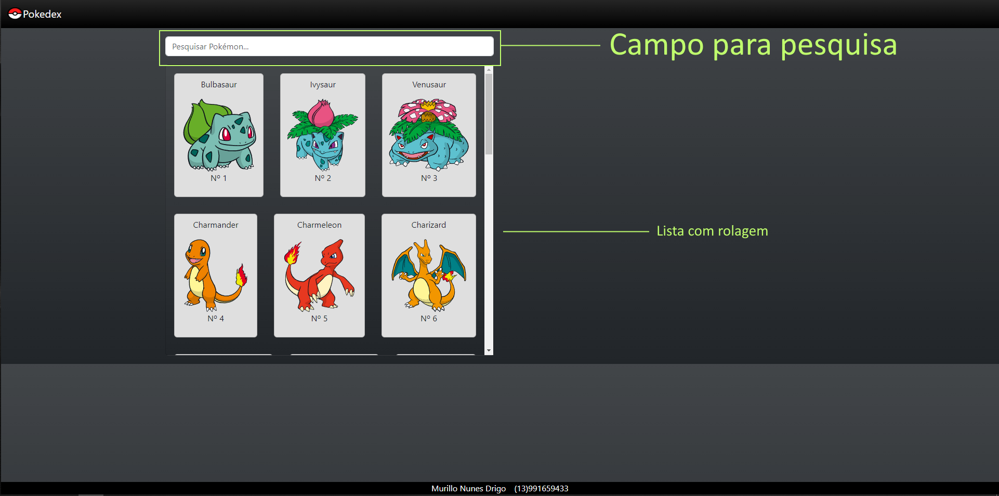
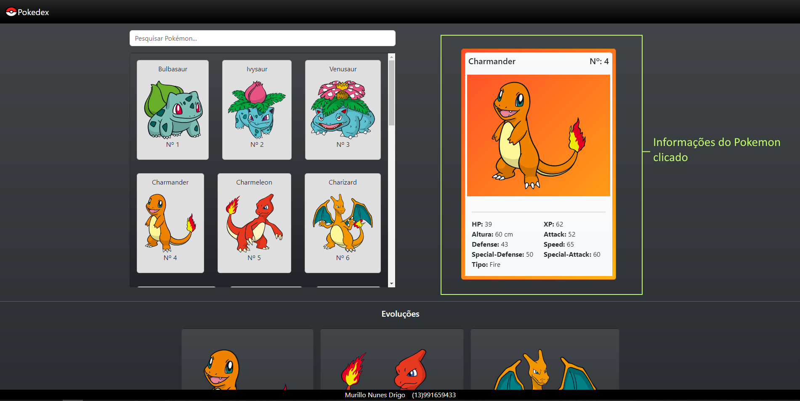
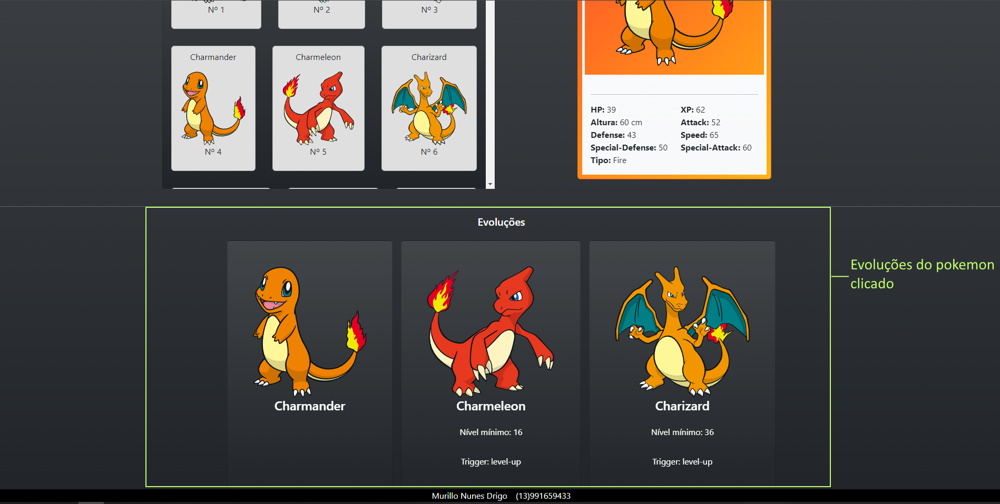
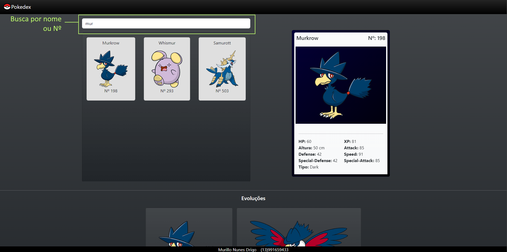
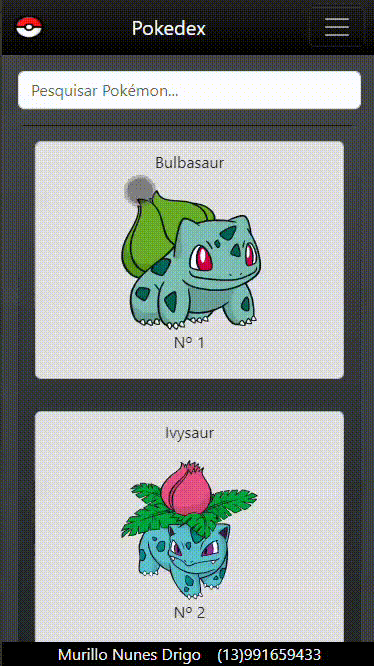

# Pokedex App

Este é um aplicativo de busca de Pokémons construído com **Vue.js 3** e **Vite**, que permite aos usuários pesquisar Pokémons por nome ou número. O app também exibe detalhes do Pokémon selecionado, como estatísticas e evoluções.

## Tecnologias Utilizadas

- **Vue.js 3**: Framework JavaScript progressivo.
- **Vite**: Ferramenta de build e bundler ultrarrápido.
- **PokeAPI**: API pública usada para obter dados sobre Pokémons.
- **TypeScript**: Utilizado para tipagem estática no código Vue.

## Funcionalidades

- Pesquisar Pokémons por nome ou número.
- Visualizar detalhes do Pokémon selecionado, como:
  - Nome
  - ID
  - Experiência base
  - Altura
  - Imagem (Sprite)
  - Estatísticas (HP, Ataque, Defesa, Velocidade, etc.)
  - Tipos do Pokémon
- Exibir evoluções do Pokémon selecionado.

## Estrutura do Projeto

### Utilizando a Pokedex

## Desktop





## Mobile



### Components

- **CardPokemonSelected.vue**: Exibe detalhes do Pokémon selecionado.
- **ListPokemons.vue**: Lista os Pokémons com base na busca e filtro selecionado.
- **PokemonEvolutions.vue**: Mostra as evoluções do Pokémon.

### Views

- **HomeView.vue**: A principal view do aplicativo, onde os componentes são montados e a lógica de busca e filtragem é realizada.

## Como Rodar o Projeto


### Pré-requisitos

- [Node.js](https://nodejs.org/) (versão 12 ou superior)
- [Vite](https://vitejs.dev/)

### Instalação

1. Clone o repositório:

```bash
git clone https://github.com/seu-usuario/seu-repositorio.git
```

2. Navegue até o diretório do projeto:

```bash
git clone https://github.com/seu-usuario/seu-repositorio.git
```
3. Instale as dependências:

```bash
npm install
```
4. Rodando a Aplicação
 
```bash
npm run dev
```